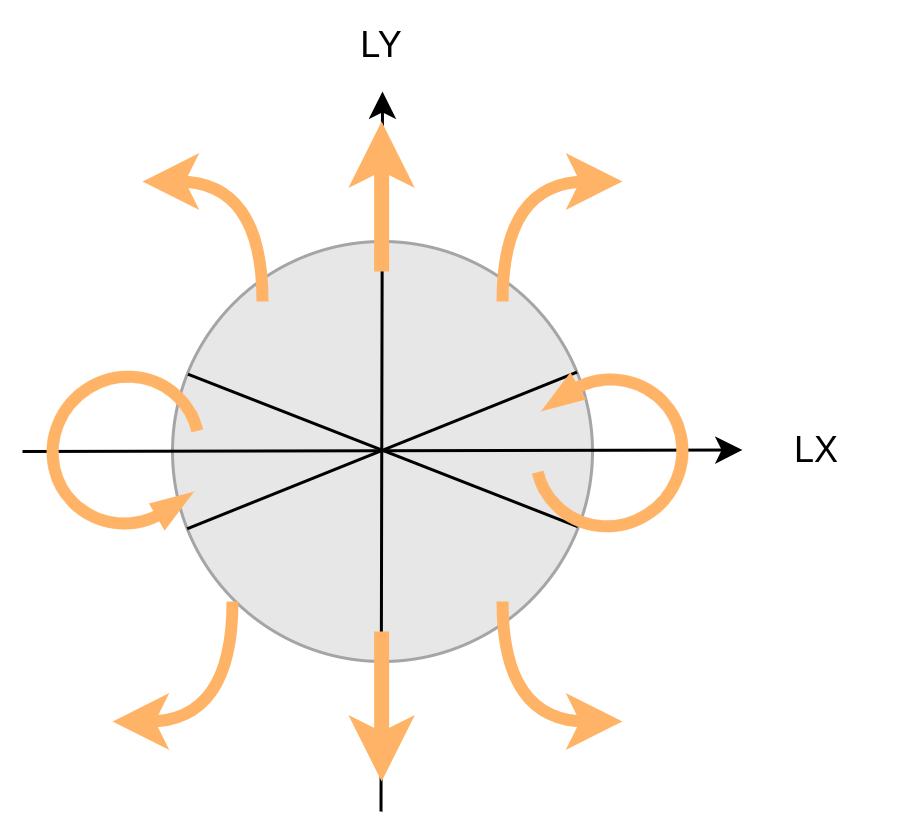

# PlayStation-JoyInterface-ROS2
PlayStation Joy Controller Interface Package for ROS2.


## Supported controllers

| Status             | Hardware Name |
| ------------------ | ------------- |
| :heavy_check_mark: | `DualShock3`  |
| :heavy_check_mark: | `DualShock4`  |
| :heavy_check_mark: | `DualSense`   |

## Repository Status

| ROS2 Distro | Branch | Build status |
| --- | --- | --- |
| **galactic** | [`galactic`](https://github.com/HarvestX/PlayStation-JoyInterface-ROS2/tree/galactic) | [](https://github.com/HarvestX/PlayStation-JoyInterface-ROS2/actions/workflows/ci_galactic.yml?branch=main)
| **humble** | [`humble`](https://github.com/HarvestX/PlayStation-JoyInterface-ROS2/tree/humble) | [](https://github.com/HarvestX/PlayStation-JoyInterface-ROS2/actions/workflows/ci_humble.yml?branch=main)


## How to use the interface library
1. Initialize controller interface with the specific hardware type.
```cpp
// Initialize Interface
const std::string hw_name = "DualSense";
const auto hw_type = p9n_interface::getHwType(hw_name);
ps_interface =
  std::make_unique<p9n_interface::PlayStationInterface>(hw_type);
```

2. Set `sensor_msg::msg::joy` to interface. Then you can access any button state via the interface.
```cpp
void Example::onJoyCallback(sensor_msgs::msg::Joy::ConstSharedPtr joy_msg) {
  ps_interface->setJoyMsg(joy_msg);  // set joy message to interface

  // When Circle Button Pressed..
  if(ps_interface->pressedCircle()) {
    // You can hook action here
...
```

## Buttons and Interface functions.

| Target          | Type    | Function Name         | Description                                                       |
| --------------- | ------- | --------------------- | ----------------------------------------------------------------- |
| Any             | `bool`  | `pressedAny();`       | Return `true` when pressed                                        |
| □               | `bool`  | `pressedSquare();`    |                                                                   |
| ○               | `bool`  | `pressedCircle();`    |                                                                   |
| □               | `bool`  | `pressedTriangle();`  |                                                                   |
| ☓               | `bool`  | `pressedCross();`     |                                                                   |
| L1              | `bool`  | `pressedL1();`        |                                                                   |
| R1              | `bool`  | `pressedR1();`        |                                                                   |
| R2              | `bool`  | `pressedR2();`        | `pressedR2Analog()`  also returns the button status with  `float` |
| L2              | `bool`  | `pressedL2();`        | `pressedL2Analog()` also returns the button status with `float`   |
| Select          | `bool`  | `pressedSelect();`    |                                                                   |
| Start           | `bool`  | `pressedStart();`     |                                                                   |
| PS              | `bool`  | `pressedPS();`        |                                                                   |
| DPad ↑          | `bool`  | `pressedDPadUp();`    | `pressedDPadY()`  also returns the button status with  `float`    |
| DPad ↓          | `bool`  | `pressedDPadDown();`  | `pressedDPadY()`  also returns the button status with  `float`    |
| DPad ←          | `bool`  | `pressedDPadLeft();`  | `pressedDPadX()`  also returns the button status with  `float`    |
| DPad →          | `bool`  | `pressedDPadRight();` | `pressedDPadX()`  also returns the button status with  `float`    |
| DPad ← →        | `float` | `pressedDPadX();`     | `-1.0` : Right, `1.0` : Left                                      |
| DPad ↑ ↓        | `float` | `pressedDPadY();`     | `-1.0`  : Down,  `1.0`  : Up                                      |
| Left Stick ← →  | `float` | `tiltedStickLX();`    | `-1.0`  : Right,  `1.0`  : Left                                   |
| Left Stick ↑ ↓  | `float` | `tiltedStickLY();`    | `-1.0`  : Down,  `1.0`  : Up                                      |
| Left Stick      | `bool`  | `isTiltedL();`        | Return `true` when L stick is tilted                              |
| Right Stick ← → | `float` | `tiltedStickRX();`    | `-1.0`  : Right,  `1.0`  : Left                                   |
| Right Stick ↑ ↓ | `float` | `tiltedStickRY();`    | `-1.0`  : Down,  `1.0`  : Up                                      |
| Right Stick     | `bool`  | `tiltedStickRY();`    | Return `true` when R stick is tiled                               |
| R2              | `float` | `pressedR2Analog();`  | `-1.0` : Pressed, `1.0` : Not pressed                             |
| L2              | `float` | `pressedL2Analog();`  | `-1.0`  : Pressed,  `1.0`  : Not pressed                          |


## Convert from Left Joy Stick to cmd_vel
`teleop_twist_joy_node` has cmd_vel publisher.
Velocity is decided as below.



## Acknowledgements
We acknowledge attribute and gratitude to the following resources in creating this package.

- [ps_ros2_common](https://github.com/Ar-Ray-code/ps_ros2_common) by @Ar-Ray-code
