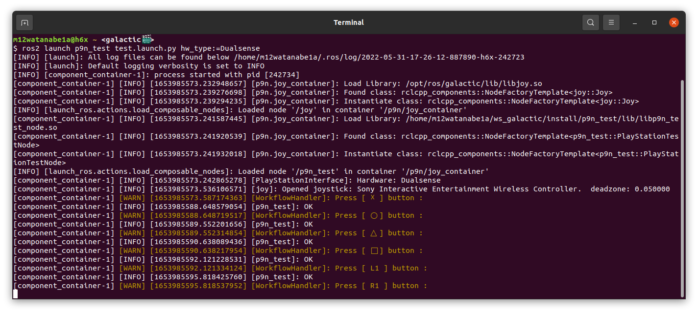

# PlayStation Interface Test
This Package helps developer to ensure that the button interface is working nicely.

### Launch Test


```bash
ros2 launch p9n_test test.launch.py hw_type:=DualSense
```

This process asks you to press the specific key. Then you need to press the actual hardware button of your controller and check all button interface step by step.

You can select your own Hardware via `hw_type` parameter.
And this repository supports following hardware.
- `DualShock3`
- `DualShock4`
- `DualSense`
